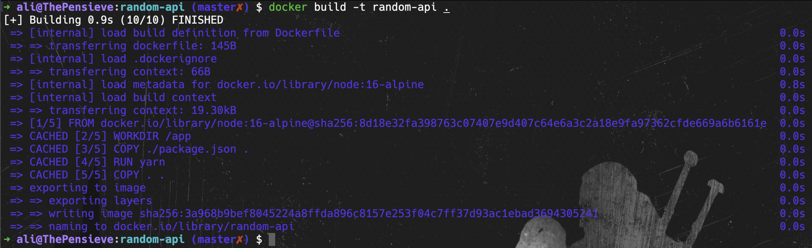
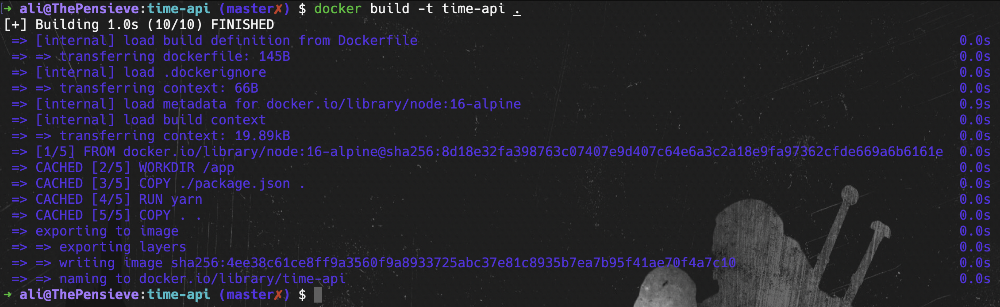
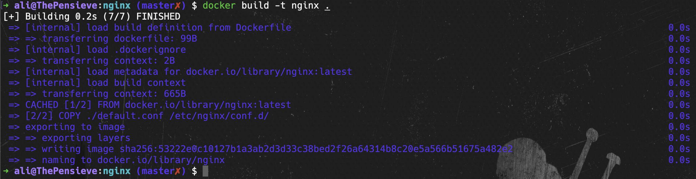
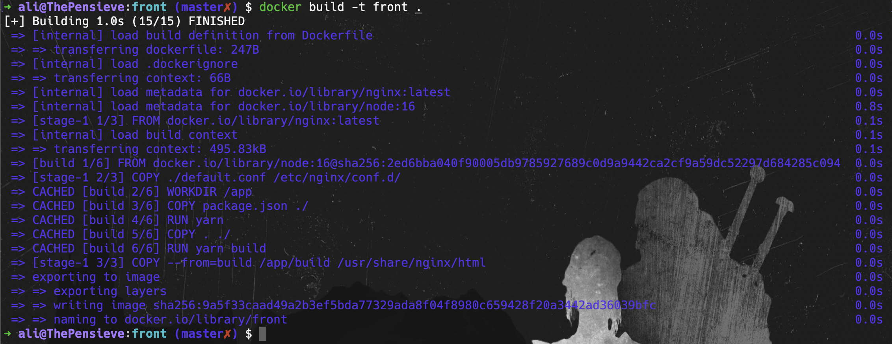
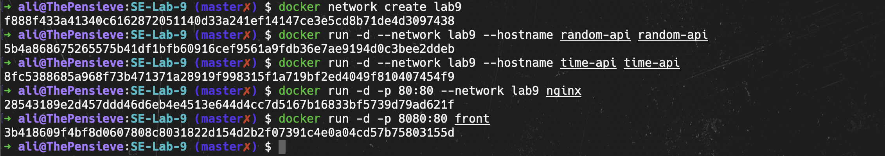
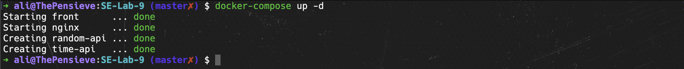
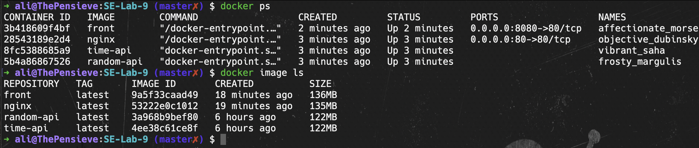
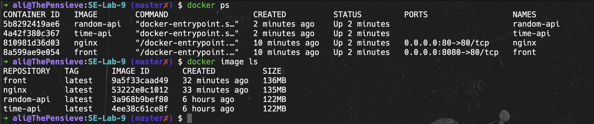
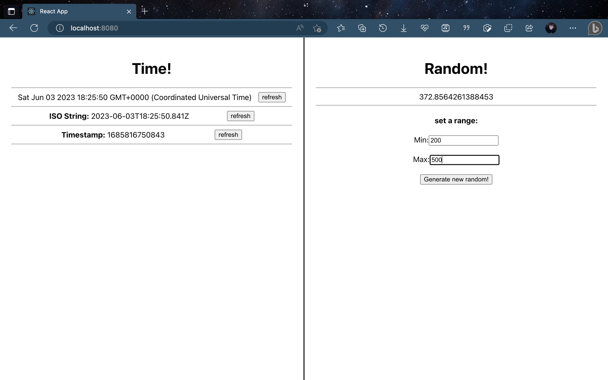

# آزمایش نهم - آز نرم

در این آزمایش، دو سرویس بسیار ساده طراحی شدند که از طریق یک سرویس دیگر (nginx) به آنها می‌توان دسترسی پیدا کرد. سرویس چهارم نیز رابط کاربری (ui) برای دریافت و نمایش اطلاعات این سرویس‌ها است؛ در واقع front-end این پروژه است. از آنجا تمرکز این آزمایش بر روی معماری میکروسرویس و داکر است؛ از توضیحات اضافه برای هر سرویس پرهیز می‌کنیم و مراحل ساخت image و اجرای containerها برای هر پروژه را در زیر می‌آوریم:

---

### ۱. مرحله‌ی build کردن هر پروژه:

سرویس random api که یک عدد رندوم به ما می‌دهد:

سرویس time api که تاریخ و زمان را در قالب utc به ما می‌دهد:

سرویس nginx که برای دسترسی به دو سرویس قبل (reverse proxy) استفاده می‌شود:

و در نهایت، سرویس front که uiای برای دسترسی به سرویس‌های ساخته شده است:

---

### ۲. ساختن یک شبکه‌ی مجازی و اجرای هر سرویس در یک container:

ساخت شبکه‌ی مجازی (virtual network) و اجرای containerها:

همچنین یک فایل docker-compose نیز نوشته شد که می‌توان برای اجرا از آن استفاده کرد:

---

### ۳. خروجی دستورهای docker ps و docker image ls

خروجی این دستورات بعد از اجرا با دستورهای docker:

خروجی این دستورات بعد از اجرا به وسیله‌ی docker-compose (لازم به ذکر است که قبل از اجرا به وسیله‌ی docker-compose، تمامی containerهای پیشین متوقف و حذف شدند):

---

### ۴. اجرای موفق برنامه:

